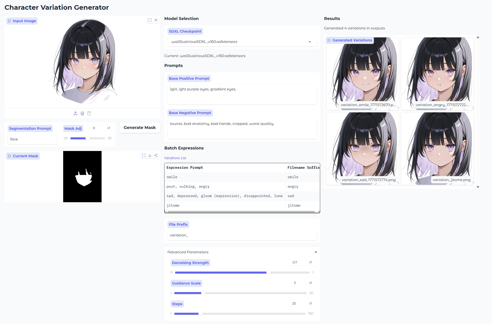

# Character Variation Generator

キャラクターの画像から表情差分を生成するツールです。



## インストール手順

1. **リポジトリのクローン**
   ```bash
   git clone https://github.com/Y-Kitaro/CharacterVariationGenerator.git
   cd CharacterVariationGenerator
   ```

2. **Pytorchのインストール**
   ```bash
   pip install torch torchvision torchaudio --index-url https://download.pytorch.org/whl/cu129
   ```


3. **依存ライブラリのインストール**
   ```bash
   pip install -r requirements.txt
   ```

## モデルのセットアップ (手動ダウンロード)

本ツールを使用するには、いくつかのモデルを手動でダウンロードして `assets/models/` ディレクトリ（または指定のパス）に配置する必要があります。

### 1. Mask Generator (Meta SAM3)
*   **モデル**: SAM3 (via Ultralytics)
*   **手順**:
    `sam3.pt`をダウンロードし、`assets/models/`の配下に配置してください。

    https://huggingface.co/facebook/sam3

### 2. Expression Editor (SDXL)
*   **モデル**: アニメ系SDXLモデルを推奨(動作ではリアス系モデルを想定)
*   **手順**:
    Civitaiなどから好みのSDXL Checkpoint (.safetensors) をダウンロードし、任意の場所に保存してください。
    `config/settings.yaml` の `expression_editor.model_directories` に格納したフォルダのパスを記述してください。
    デフォルトでは `assets/models/sdxl` に格納したフォルダのパスが記述されています。

## 使い方
0. **起動**
```bash
python app.py
```
ブラウザで `http://127.0.0.1:7860` にアクセスしてください。

1. **キャラクター画像を選択**
   - ツール画面の「Upload Character Image」から、キャラクターの立ち絵を選択します。

2. **マスクの生成**
   - 「Generate Mask」ボタンをクリックします。
   - SAM3モデルが自動的にキャラクターの輪郭を検出し、マスクを生成します。
   - 生成されたマスクはプレビューで確認できます。

3. **表情の編集**
   - **モデル選択**: `config/settings.yaml` の `expression_editor.model_directories` で指定したフォルダから使用するモデルを選択します。
   - **プロンプト入力**: ベースとなるポジティブプロンプトをテキストで入力します。主に顔に関連するプロンプトを記載してください。
     - 例: `eye`, `pupils`, `mouth`, `nose`, `eyebrows`, `face shape`, etc.
   - **ネガティブプロンプト**: ベースとなるネガティブプロンプトをテキストで入力します。
     - 例: `ugly`, `deformed`, `blurry` など
   - **表情プロンプト**: 生成したい差分表情のプロンプトを入力します。また、保存時のファイル名にも使用されます。
     - 例: `smile`, `frown`, `angry`, `happy`, `sad`, etc.
   - **ファイル名プレフィックス**:ファイル名の先頭に付与されます。キャラクター名など管理用の情報を入力してください。
   - **パラメータ調整 Advanced Parameters**:
     - **Denoising Strength**: マスクの適用度合いを調整します。値が大きいほど元の画像から離れ、プロンプトの影響が強くなります。
     - **Guidance Scale**: プロンプトへの忠実度を調整します。
   - 「Generate Batch」ボタンをクリックすると、表情が編集された画像が生成されます。

4. **結果の確認**
   - 生成された画像はギャラリーに表示されます。
   - また、`outputs/images/` に生成された画像が保存されます。
